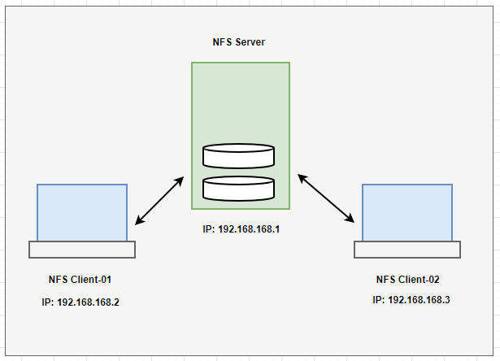

## NFS Server:

Network File System (NFS) is a distributed file system protocol, to share the files and folders between the Linux/Unix systems. Configuring an NFS (Network File System) server involves several steps, including installing the necessary software, configuring exports, and setting up client access. Since it's like a client-server model, we need to setup server and client individually.

The main ports used by NFS and its associated services are as follows:

- NFS Server (nfsd): Default port: 2049 (TCP/UDP)
- Portmapper/RPCBind: Default port: 111 (TCP/UDP)


The following are the important NFS services, included in nfs-utils packages: 

- rpcbind: The rpcbind server converts RPC program numbers into universal addresses.

- nfs-server: It enables clients to access NFS shares.

- nfs-lock / rpc-statd: NFS file locking. Implement file lock recovery when an NFS server crashes and reboots.

- nfs-idmap: It translates user and group ids into names, and to translate user and group names into ids


### NFS Configuration Files:

- `/etc/exports` : Its a main configuration file of NFS, it defines which directories are shared with which clients and with what permissions.
- `/etc/sysconfig/nfs` (CentOS/RHEL): Configuration file of NFS to control on which port rpc and other services are listening.
- `/etc/default/nfs-kernel-server` (Ubuntu/Debian) : This file contains options for the NFS kernel server.
- `/etc/nfs.conf` : Modern Linux distributions may use /etc/nfs.conf for configuring NFS services. This file can unify the settings for all NFS-related services.
- `/etc/fstab` : To mount a NFS directory on your system across the reboots, we need to make an entry in /etc/fstab.


## NFS Server Configuration:

Here's a step-by-step guide to setting up an NFS server on a Linux system: 




```
### CentOS/RHEL:

yum update -y

yum install -y nfs* rpcbind*
yum install -y nfs-utils
```


```
### CentOS/RHEL:

systemctl start nfs-server
systemctl enable nfs-server
systemctl status rpcbind  
systemctl status nfs-server
systemctl status nfs 
```


```
### Ubuntu/Debian:

apt update
apt install -y nfs-kernel-server
```


```
### Ubuntu/Debian:

systemctl start nfs-kernel-server
systemctl status nfs-kernel-server
systemctl enable nfs-kernel-server
```


### Create Share Directories in NFS Server:

```
mkdir /nfs_share
chmod -R 775 /nfs_share
```


```
### Optional: 
chown nfsnobody:nfsnobody /nfs_share
```


### Configure NFS Exports:

- `/nfs_share` : shared directory
- `*` : available to all networks
- `192.168.168.2` : clients ip
- `192.168.168.0/24` : IP address range of clients
- `ro` : read only to shared folder
- `rw` : Writable permission to shared folder
- `sync` : Synchronize shared directory
- `no_root_squash` : Enable root privilege
- `no_all_squash` : Enable user's authority
- `no_subtree_check` : Disables subtree checking to improve performance.


```
vim /etc/exports


## The directories and files are available to all networks '*': 
#/nfs_share *(ro)
/nfs_share *(rw,no_root_squash)

## Specific client IP (Share access to particular host)
#/nfs_share  client_IP (rw,sync,no_root_squash)
#/nfs_share 192.168.168.1 (rw,sync,no_root_squash)

## Specifies the subnet (Share access to particular network):
#/nfs_share 192.168.168.0/24(rw,sync,no_root_squash)

# Share access to all hosts in particular domain:
#nfs_share		*.example.com(rw,sync,no_root_squash)


save and exit 
```


```
systemctl restart nfs-server
systemctl status nfs-server
```


```
rpcinfo -p
rpcinfo -p 192.168.168.1
```


### Export the Shared Directory:

Apply the changes made in `/etc/exports`:

- `exportfs -a` : Exports all shares listed in /etc/exports, or given name
- `exportfs -r` : Refresh the server's list after modifying /etc/exports
- `exportfs -v` : Displays a list of shares files and options on a server
- `exportfs -u` : Unexports all shares listed in /etc/exports, or given name

- `showmount -e` : Shows the available shares on your local machine
- `showmount -e [server_ip or hostname]`: Lists the available shares at the remote server
- `showmount -d` : Lists all the sub directories


```
exportfs -avr
	
	exporting *:/nfs_share
```


```
exportfs -s
	
	/nfs_share  *(sync,wdelay,hide,no_subtree_check,sec=sys,rw,secure,no_root_squash,no_all_squash)
```


```
showmount -e sever_ip
showmount -e 192.168.168.1

	Export list for 192.168.168.1:
	/nfs_share *
```


---
---


## NFS Client Configuration:

Install NFS client utilities:

```
### CentOS/RHEL:

yum install -y nfs-utils
```


```
### Ubuntu/Debian:

apt install -y nfs-common
```


### Create a mount point:: 

Mount NFS clients manually:

```
mkdir /nfs_data

chmod -R 775 /nfs_data
```


```
showmount -e 192.168.168.1

	Export list for 192.168.168.1:
	/nfs_share *
```


```
### Mount the NFS share:  (Replace the IP address of your NFS server).

mount -t nfs {NFS_server_IP}:{shared_dir_path_server} /path/to/client_dir_path

mount -t nfs 192.168.168.1:/nfs_share /nfs_data

or,

mount 192.168.168.1:/nfs_share /nfs_data
```


### Verify:

```
df -h

Filesystem                Size  Used Avail Use% Mounted on

.....
.....
192.168.168.1:/nfs_share   90G   16G   74G  18% /nfs_data
```


```
### Client-side:

echo "Hello from NFS clinet-01" >> /nfs_data/testing.txt
```


```
### Server-side:

cat /nfs_share/testing.txt
```


```
### Unmount:

umount /nfs_data
```


### Permanent NFS Client Mount:

To mount the NFS share automatically at boot, add the following line to `/etc/fstab`:

```
vim /etc/fstab


# NFS_SERVER:/PATH/TO/DIR    /MOUNT_ON_CLIENT    TYPE   OPTIONS   DUMP	PASS
192.168.168.1:/nfs_share     /nfs_data           nfs    defaults   0     0


save and exit
```


Before rebooting, it's a good idea to test the `mount -a` to ensure it works correctly: 

```
mount -a
```


By following these steps, you will have a functioning NFS server and client setup.


